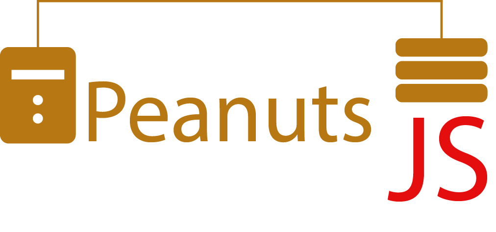
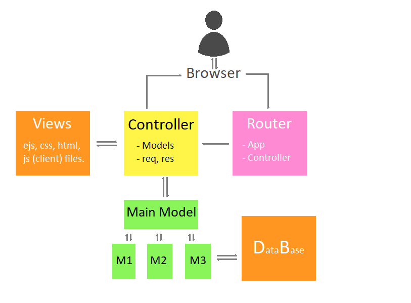

# *PeanutsJS* - MVC Node.js Server



### Index: 

1. [Introduction](#introduction)
1. [Model View Controller](#model-view-controller)
1. [Getting Started](#getting-started)
1. [Prerequisites](#prerequisites)
1. [Installing](#installing)
1. [Deployment](#deployment)
1. [Built with](#built-with)
1. [Contributing](#contributing)
1. [Author](#author)
1. [License](#license)
1. [Acknowledgments](#acknowledgments)

## Introduction
*PeanutsJS* is my own implementation of the Model-View-Controller ([MVC](https://en.wikipedia.org/wiki/Model%E2%80%93view%E2%80%93controller)) concept in Node.js. It is an [Express](https://expressjs.com/) based server with MVC architecture. It employs [mySQL](https://www.mysql.com/) databases to store persistent data and authentication information with hashed passwords. It's clearly organized to use [EJS](https://ejs.co/) templates engine. You can run it locally, deploy it to [Heroku](https://www.heroku.com/) or to any other [PASS](https://en.wikipedia.org/wiki/Platform_as_a_service) as with any other web app.

With *PeanutsJS* you will be able to:

* Create **static websites** to serve pages. *(However, if this is your purpose, you may want to check out [GitHub Pages](https://pages.github.com/) for a simpler solution).*
* Develop **interactive websites** with forms, dynamic content, etc.
* **Authentication systems** to select displayed contents to different users, and **persistent sessions**.
* You will have absolute flexibility to edit pages, styles, elements, and requests handling, etc. You could even [create a platformer](https://youtu.be/FGxdoHezkks?t=393), or a [real time multiplayer](http://buildnewgames.com/real-time-multiplayer/) within *PeanutsJS*.


😉 **Target audience:** *PeanutsJS* is a learning-by-doing environment for those who want to explore Node.js or back-end development in general. The server can be used as a template for developing organized modularized and sustainably expandable web apps. It also provides the files structure to illustrate in a minimal example the relationship between server, authentication and data storage.

⚠️ Note you should feel somehow comfortable with asynchronous javascript: particularly [Promises](https://www.promisejs.org/) syntax before working with *PeanutsJS*. You should also be familiar with basic web development tools: html, css, js. If you wish to perform database queries, you should know a litle bit of SQL language. Nevertheless, you will always find tons of information in youtube, documentation, etc. about the very specifics.

## Model View Controller

Model View Controller (MVC) is a concept related to how to organize code in self-contained modules with clear responsibilities. This makes the process of increasing functionality easy and viable. You will find a lot of information about it in the web. However, how to implement the concept may be confusing at first glance. MVC can be applied to many contexts; and, there are many ways of implementing MVC. *PeanutsJS* follows the next pattern for the web development context:



1. The **user** interacts directly with the web browser.
1. The browser makes a **request** to the app or emits some order under some information protocol.
1. The **Router** is a .js file. It has a reference to the **express server** (app), so it declares the functions associated to every request in the app, and to the **controller**, so it calls the correspondent function defined inside it.
1. The **Controller** is another .js module. It receives as parameters the request and response objects from the router. The controller asks the models to process the request's data.
1. The **Models** are divided into separate .js files. Thereby, the logic and data handling of the app can be easily modularized in manageable, self-contained files. A function in a model **returns** the processed data to the controller.
1. Once the controller has the processed information, it **renders, sends a file, etc.** to display to the user from the views via the response object. These are simple html, css, ejs and client javascript files.
1. Finally, the browser **displays** the rendered file or response to the user.

The 01-main.js file initializes the references between each module once the server is started, so they can communicate between themselves.

## Getting Started

To start a **Hello World** web app running *PeanutsJS* on your computer, follow the [Installing](#installing) section of this document.

To add a new page to the whole MVC structure, follow the document: [Adding a New Page](./04-doc/add-new-page.md).

To understand the authentication example, visit the document: [Sessions and Authentication](./04-doc/authentication.md).


## Prerequisites

To use *PeanutsJS* you need to install [Node.js](https://nodejs.org/). If you want to use database functions, you will have to install [mySQL Community Server](https://dev.mysql.com/downloads/installer/). I recommend to install the [mySQL Workbench](https://dev.mysql.com/downloads/workbench/) as well, so you can visually check the state of your databases.

To install the required software for *PeanutsJS* to work, you should execute

```
npm install
```
which will create the *node_modules* folder with the indicated dependencies in [package.json](package.json).

Follow the [Installing](#installing) section for a detailed explanation on how to configure your environment.

To deploy to Heroku, you will need the Heroku CLI, follow the [Deployment section](#deployment) for more details.

You will need a text editor as well. There are many options for you to choose. One of the most common editors is [Visual Studio Code](https://code.visualstudio.com/), as a complete development environment. [Atom](https://atom.io/) is another great option. I personally like [Sublime Text](https://www.sublimetext.com/) because of its elegantly light nature and huge versatility to work with any language. 

## Installing

*PeanutsJS* comes with some examples when you first clone it. The next are the **routes you can visit in the life server**: 

* **/** - Default route, you will find an example page that uses database query. Every time you load it a random person is taken from the database, you will see their information.

* **/signup** - You will find a form to register a new user. The user will have access to the restricted content.

* **/login** - You will find a form to authenticate as a registered user. Only after authenticating, you will have access to the restricted content.

* **/restricted** - An example restricted content page. You will see a button to logout as well.

You can see the **[Life Demo](https://peanutsjs.herokuapp.com/)**.

To use *PeanutsJS* locally, first configure your environment. Please follow the next steps:

1. [Install mySQL server and Workbench](https://www.youtube.com/watch?v=u96rVINbAUI)
1. Remember to download and install [Node.js](https://nodejs.org/).
1. You may need [git](https://git-scm.com/downloads) as well to clone the repository, and eventually to deploy to Heroku.

Next, clone *PeanutsJS* repository into your computer:

```
git clone https://github.com/alorozco22/peanutsjs-stable.git
```

Now, place your command prompt inside your *PeanutsJS* directory and install the required dependencies:

```
cd peanutsjs-stable
npm install
```

You may have to configure your database connection. Please **create a .env file** in the root folder of your server. Edit the contents of the file following the [example for a dotEnv file](Example-dotEnv.txt).

To allow connections to the database via Node.js, you may have to execute the next query within your workbench:

```
ALTER USER 'root'@'localhost' IDENTIFIED WITH mysql_native_password BY '[myPassword]'
```
Replace *[myPassword]* with your own password for connecting to the database.

Configure your app information by editing the package.json file in the root of your app:

```js
{
  "name": "PeanutsJS", // NAME OF YOUR APP
  "version": "1.0.0", // VERSION
  "description": "MVC Framework for Nodejs server, using EJS, and mySQL database.", // DESCRIPTION
  "main": "01-main.js",
  "scripts": {
    "test": "echo \"Error: no test specified\" && exit 1"
  },
  "author": "Alfredo Eleazar Orozco Quesada <ae.orozco10@uniandes.edu.co>", // AUTHOR
  "license": "MIT", // LICENSE
  "dependencies": {
    "bcryptjs": "^2.4.3",
    "body-parser": "^1.19.0",
    "cors": "^2.8.5",
    "csurf": "^1.10.0",
    "dotenv": "^8.2.0",
    "ejs": "^3.0.1",
    "express": "^4.17.1",
    "express-mysql-session": "^2.1.0",
    "express-session": "^1.17.0",
    "mysql": "^2.17.1",
    "path": "^0.12.7"
  }
}

```

Install your dependencies by running: 

```
npm install
```

Finally, execute your server with:

```
node 01-main.js
```

You should be able to see the life demo in your [localhost:4004](http://localhost:4004/).

<!--
## Running the tests

Explain how to run the automated tests for this system

### Break down into end to end tests

Explain what these tests test and why

```
Give an example
```

### And coding style tests

Explain what these tests test and why

```
Give an example
```
-->

## Deployment

You can deploy to any service you prefere. I use Heroku, the free service is enough for many apps. To deploy to heroku, please follow [this article](./04-doc/deployment.md). 

Follow the next article to find [general information](https://devcenter.heroku.com/articles/deploying-nodejs) on how to deploy Node.js to Heroku.

## Built With

* [Node.js](https://nodejs.org/) - Javascript Runtime
* [Express](https://expressjs.com/) - Web framework for Node.js
* [MySQL](https://www.mysql.com/) - Database 
* [EJS](https://ejs.co/) - Templating language

Every asynchronous instruction is written in native [Promises](https://www.promisejs.org/) syntax.

## Contributing
<!--
Please read [CONTRIBUTING.md](https://gist.github.com/PurpleBooth/b24679402957c63ec426) for details on our code of conduct, and the process for submitting pull requests to us.-->

If you have any feedback or ideas to improve *PeanutsJS*, please e-mail me first to ae.orozco10@uniandes.edu.co, so we can discuss the proposed changes. I'll be glad to listen and learn.

## Author

* **Alfredo Eleazar Orozco Quesada** - *Developer* - [GitHub](https://github.com/alorozco22)

<!-- See also the list of [contributors](https://github.com/your/project/contributors) who participated in this project.-->

## License

This project is licensed under the MIT License - see the [LICENSE.txt](LICENSE.txt) file for details.

## Acknowledgments

* Thanks to Asim Hussain's wonderful course on [Asynchronous JavaScript](https://www.udemy.com/course/asynchronous-javascript).
* Thanks to [W3Schools](https://www.w3schools.com/) with whose extremely clear courses I took my first steps in web development nearly nine eight ago.
* [Billie Thompson](https://gist.github.com/PurpleBooth/109311bb0361f32d87a2) for her excellent readme file template.
